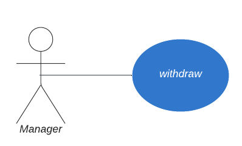
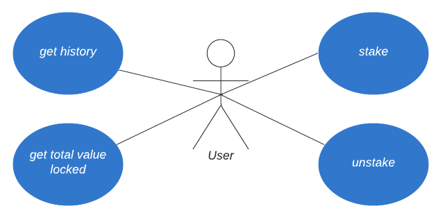

# Staking contracts use cases

Status:  

- [x] DRAFT
- [ ] APPROVED
- [ ] SUBMITTED
- [ ] AUDITED
- [ ] PASSED & PUBLIC

 

### Terms

- **Manager** - DAO address, all the decisions should be made/approved by the majority of members.
- **Controller** - Contract, which purpose is mainly to reduce the number of votes required to upgrade other contracts.

_Contoller perform operations that require updating more than a one contract, while Manager does a specific (one contract related) operations._

 

## Manager use **cases**

### Withdraw token `withdraw()`

An Owner can withdraw unclaimed tokens to the specified address. Storage balance is not affected.

 

## Controller use cases

### Pause (OZ Pausable.sol) `pause()`

The Controller can pause the contract, which should stop both, staking, and unstaking. Effectively, it means no one can withdraw their funds or add more funds.

### Unpause (OZ Pausable.sol) `unpause()`

The Controller can unpause paused contract to allow staking and unstaking again.

### Update Controller contract (OZ AccessControl.sol) `setController()`

The Controller can update `CONTROLLER_ROLE` to assign another Controller contract in case it's upgraded.

### Initialize contract `init()`

The Controller can initialize the contract with all required addresses (tokens, storage, logic, controller, ...).

 

## User use cases

### Stake tokens `stake()`

Staking is the process of locking your ASTO or LP tokens in the contract.
Users can add more tokens (increase their stake) anytime.

### Unstake tokens `unstake()`

Unstaking is the process of unlocking (getting back) your tokens.
Users can arbitrarily decrease the amount of staked tokens, up to 0.

### Get the address' staking history `getHistory()`

Returns all the stakes of the address

### Get the total amount of tokens staked in the contract `getTotalValueLocked()`

How many tokens are staked in the contract right now.

 
