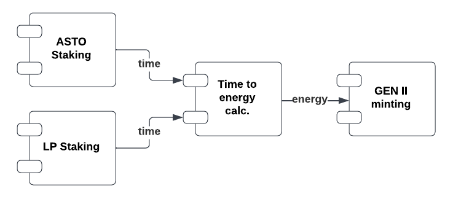

# Glossary

Authors: alex.tikonoff@alteredstatemachine.xyz

Approvers: pulasthi.bandara@alteredstatemachine.xyz, craig.boxall@alteredstatemachine.xyz

Status:  

- [x] DRAFT
- [ ] APPROVED
- [ ] SUBMITTED
- [ ] AUDITED
- [ ] PASSED & PUBLIC

Staking, Conversion, and Minting are separated.

## Staking

Staking is the process of locking your ASTO or LP tokens in the contract.

In return, you will get a reward for the time you locked your tokens, but later. No direct reward for staking tokens for the user. See reward section.

All staking/unstaking history is recorded.
You can unlock (unstake) your tokens anytime and get them back.

### Unstaking

Unstaking is the process of unlocking (getting back) your ASTO or LP tokens.
No direct reward for the user.

## Time to Energy conversion (calculation)

There are 3 mining periods when user’s energy is calculated based on user’s tokens staking time.

Technically it means the Calculator contract calls the staking contract to get the time users tokens remained staked and apply conversion from time to energy units.
There is a general conversion rate of time into energy: e = Token \* time:

staking 1 token for 1 full hour gives you 1 energy unit

Staking ASTO tokens COULD give you more or less energy units than staking LP tokens, as determined by token multiplier, for example, let’s consider Mining period 1, with

- duration D equal to 30 days,
- the LP tokens have a multiplier LPk equal to 1.5,
- ASTO tokens have a multiplier Ak equal to 1,

Conversion:

e = D(Ak(ASTOtokens) + LPk(LPtokens)),
or for 200 ASTO and 100 LP tokens staked during such event:
e = 30(1(200) + 1.5(100)) = 30 \* (200+150) = 10500 Energy units

### When calculation happens

There are three possible triggers for calculations to happen:

Users check their balances during Mining Period. They pay the gas each time they call the calculation function.

Users call the minting function (during Minting Window), which, in turn, calls Calculation functions that do the math on available energy balance and transfer it to the minting contract. Users pay the gas as originators of the function call.

At the start of each minting window, the minting contract calls the Calculator and thus the Minting contract pays the gas for all users. This could be a bit optimized by combining with the first approach (or doing this offchain) but still requires paying gas for energy transfers.

### Estimation

Reading staking time, calculating related energy, and storing balance on-chain is not free.

To avoid charging users every time they visit our FrontEnd pages, we will use off-chain solution.

## Minting

Energy is used by Minting contract, which requests the energy from the Calculations contract and if the specified user (wallet) has enough energy, it is transferred to the Minting contract.

It is not possible to return energy from the Minting contract back to Calculations contract.
